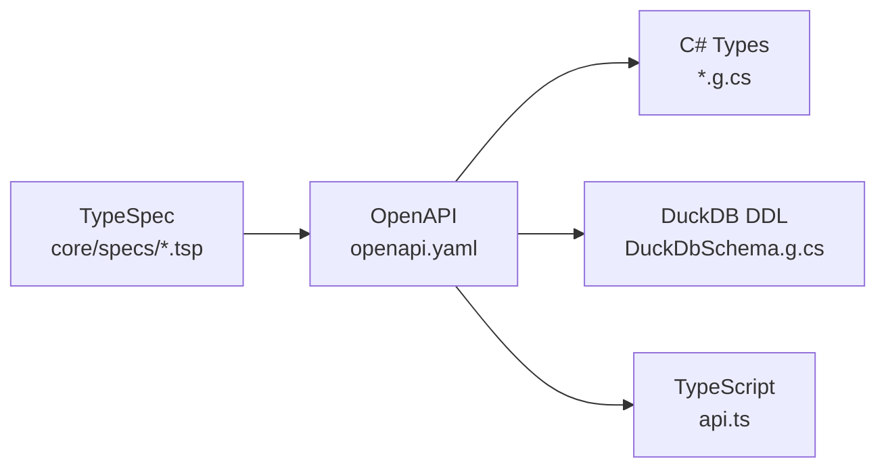

The qyl API provides programmatic access to telemetry data collected by the qyl observability platform. Query distributed traces, search logs, analyze metrics, and track deployments through a consistent REST interface.

## Quick Start

Fetch the 10 most recent traces:

```bash
curl "https://qyl-api-production.up.railway.app/v1/traces?limit=10"
```

## Base URLs

| Environment | URL                                         | Description              |
| ----------- | ------------------------------------------- | ------------------------ |
| Production  | `https://qyl-api-production.up.railway.app` | Production API (Railway) |
| Local       | `http://localhost:5100`                     | Local collector instance |

## Authentication

<Warning>
  The API is currently **public** and requires no authentication. For production
  deployments, place qyl behind a reverse proxy with your preferred
  authentication mechanism.
</Warning>

## API Versioning

The API uses date-based versioning in the URL path:

| Version | Date         | Description                 |
| ------- | ------------ | --------------------------- |
| v1      | `2024-01-01` | Initial API                 |
| v2      | `2024-06-01` | GenAI observability support |
| v3      | `2025-01-01` | Full OTel v1.39 compliance  |

All endpoints use the `/v1/` prefix. Breaking changes introduce new versions while maintaining backwards compatibility.

## Endpoints

| Category    | Description                                  |
| ----------- | -------------------------------------------- |
| Traces      | Query distributed traces and spans           |
| Logs        | Search, filter, and aggregate log records    |
| Metrics     | Query time-series metrics with aggregations  |
| Sessions    | Track user sessions and their traces         |
| Errors      | Manage error groups with status tracking     |
| Deployments | Track deployments and calculate DORA metrics |
| Services    | Discover services and their dependencies     |
| Streaming   | Real-time telemetry via Server-Sent Events   |

### Endpoint Summary

| Category    | Endpoints | Operations                                      |
| ----------- | :-------: | ----------------------------------------------- |
| Health      |     3     | Health check, liveness probe, readiness probe   |
| Traces      |     4     | List, get by ID, get spans, search              |
| Logs        |     5     | List, search, aggregate, patterns, stats        |
| Metrics     |     3     | List, query time-series, get metadata           |
| Sessions    |     4     | List, get by ID, get traces, stats              |
| Errors      |     5     | List, get, update status, stats, correlations   |
| Exceptions  |     2     | List, stats                                     |
| Deployments |     5     | List, get, create, update, DORA metrics         |
| CI/CD       |     2     | List pipeline runs, stats                       |
| Services    |     4     | List, get details, dependencies, operations     |
| Streaming   |     7     | SSE streams for traces, logs, metrics, and more |

## Pagination

All list endpoints support cursor-based pagination:

<CodeGroup>
    ```bash Request
    curl "https://qyl-api-production.up.railway.app/v1/traces?limit=50"
    ```

    ```json Response
    {
        "items": [...],
        "has_more": true,
        "next_cursor": "eyJpZCI6IjEyMyJ9"
    }
    ```

    ```bash Next Page
    curl "https://qyl-api-production.up.railway.app/v1/traces?limit=50&cursor=eyJpZCI6IjEyMyJ9"
    ```

</CodeGroup>

| Parameter | Type    | Default | Max  | Description                      |
| --------- | ------- | ------- | ---- | -------------------------------- |
| `limit`   | integer | 100     | 1000 | Maximum items per page           |
| `cursor`  | string  | —       | —    | Opaque cursor from previous page |

## Response Headers

Every response includes correlation headers for debugging:

| Header         | Description                             |
| -------------- | --------------------------------------- |
| `X-Trace-Id`   | Distributed trace ID for the request    |
| `X-Request-Id` | Unique request ID for support reference |

<Tip>
  Include these headers when reporting issues. They help trace the request
  through the system.
</Tip>

## Error Handling

Errors follow the [RFC 7807](https://datatracker.ietf.org/doc/html/rfc7807) Problem Details format:

```json
{
  "type": "https://qyl.dev/errors/validation-failed",
  "title": "Validation Failed",
  "status": 400,
  "detail": "The 'limit' parameter must be between 1 and 1000",
  "instance": "/v1/traces?limit=5000",
  "trace_id": "abc123",
  "request_id": "req_xyz789",
  "timestamp": "2025-01-15T10:30:00Z",
  "errors": [
    {
      "field": "limit",
      "message": "Value must be at most 1000",
      "code": "max_value",
      "rejected_value": "5000"
    }
  ]
}
```

### Status Codes

| Status | Type                      | Description                                    |
| ------ | ------------------------- | ---------------------------------------------- |
| 200    | —                         | Success                                        |
| 400    | `ValidationError`         | Invalid request parameters                     |
| 404    | `NotFoundError`           | Resource not found                             |
| 409    | `ConflictError`           | Resource state conflict                        |
| 429    | `RateLimitError`          | Too many requests (includes `Retry-After`)     |
| 500    | `InternalServerError`     | Server error (include `request_id` in reports) |
| 503    | `ServiceUnavailableError` | Temporarily unavailable                        |

## Real-time Streaming

Subscribe to telemetry events in real-time using Server-Sent Events (SSE):

```bash
curl -N "https://qyl-api-production.up.railway.app/v1/stream/events?types=traces,logs"
```

Events are delivered as JSON with a `type` discriminator:

```
data: {"type":"trace","data":{...},"timestamp":"2025-01-15T10:30:00Z"}

data: {"type":"log","data":{...},"timestamp":"2025-01-15T10:30:01Z"}

data: {"type":"heartbeat","timestamp":"2025-01-15T10:30:30Z"}
```

Available event types: `traces`, `spans`, `logs`, `metrics`, `exceptions`, `deployments`, `all`

## Schema Architecture

The API schema follows a **single source of truth** pattern: TypeSpec definitions generate everything.



### Generated Artifacts

| Output        | Path                                      | Description                         |
| ------------- | ----------------------------------------- | ----------------------------------- |
| OpenAPI Spec  | `core/openapi/openapi.yaml`               | REST API definition                 |
| C# Scalars    | `qyl.protocol/Primitives/Scalars.g.cs`    | TraceId, SpanId with `IParsable<T>` |
| C# Enums      | `qyl.protocol/Enums/Enums.g.cs`           | OTel 1.39 semantic conventions      |
| C# Models     | `qyl.protocol/Models/*.g.cs`              | Request/response records            |
| DuckDB Schema | `qyl.collector/Storage/DuckDbSchema.g.cs` | DDL with indexes                    |
| TypeScript    | `qyl.dashboard/src/types/api.ts`          | Frontend types                      |

### Code Generation

The `SchemaGenerator` transforms OpenAPI into production-quality C#:

- **Strongly-typed scalars** with `IParsable<T>`, `ISpanFormattable`
- **Hex parsing** for TraceId/SpanId (hot-path optimized with `ReadOnlySpan<byte>`)
- **JSON converters** for all primitive types
- **DuckDB DDL** with proper indexes
- **Generation guard** for CI/local workflows (detects stale files)

```bash
# Generate all artifacts
nuke Generate

# Force regenerate (required for CI)
nuke Generate --force-generate
```

<Note>
  Never edit `*.g.cs` files directly. Modify the TypeSpec definitions in
  `core/specs/` and regenerate.
</Note>

## SDK & Tools

| Tool      | Description                          |
| --------- | ------------------------------------ |
| MCP       | Connect AI agents to qyl telemetry   |
| Dashboard | Visual exploration of telemetry data |
| Collector | Ingest OTLP telemetry data           |
