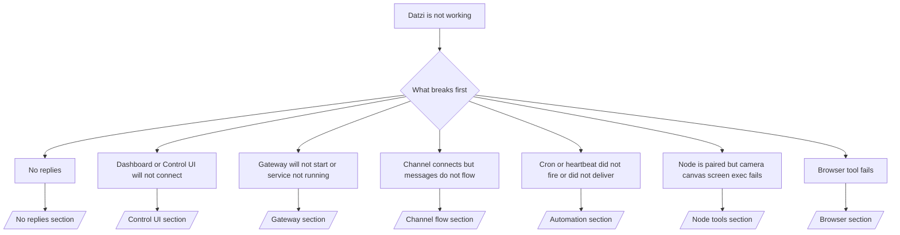

Source: https://docs.datzi.ai/help/troubleshooting

# Troubleshooting

If you only have 2 minutes, use this page as a triage front door.

## First 60 seconds

Run this exact ladder in order:

```bash
datzi status
datzi status --all
datzi gateway probe
datzi gateway status
datzi doctor
datzi channels status --probe
datzi logs --follow
```

Good output in one line:

- `datzi status` → shows configured channels and no obvious auth errors.
- `datzi status --all` → full report is present and shareable.
- `datzi gateway probe` → expected gateway target is reachable.
- `datzi gateway status` → `Runtime: running` and `RPC probe: ok`.
- `datzi doctor` → no blocking config/service errors.
- `datzi channels status --probe` → channels report `connected` or `ready`.
- `datzi logs --follow` → steady activity, no repeating fatal errors.

## Decision tree



<AccordionGroup>
  <Accordion title="No replies">
    ```bash
    datzi status
    datzi gateway status
    datzi channels status --probe
    datzi pairing list <channel>
    datzi logs --follow
    ```

    Good output looks like:

    * `Runtime: running`
    * `RPC probe: ok`
    * Your channel shows connected/ready in `channels status --probe`
    * Sender appears approved (or DM policy is open/allowlist)

    Common log signatures:

    * `drop guild message (mention required` → mention gating blocked the message in Discord.
    * `pairing request` → sender is unapproved and waiting for DM pairing approval.
    * `blocked` / `allowlist` in channel logs → sender, room, or group is filtered.

    Deep pages:

    * [/gateway/troubleshooting#no-replies](/gateway/troubleshooting#no-replies)
    * [/channels/troubleshooting](/channels/troubleshooting)
    * [/channels/pairing](/channels/pairing)

  </Accordion>

  <Accordion title="Dashboard or Control UI will not connect">
    ```bash
    datzi status
    datzi gateway status
    datzi logs --follow
    datzi doctor
    datzi channels status --probe
    ```

    Good output looks like:

    * `Dashboard: http://...` is shown in `datzi gateway status`
    * `RPC probe: ok`
    * No auth loop in logs

    Common log signatures:

    * `device identity required` → HTTP/non-secure context cannot complete device auth.
    * `unauthorized` / reconnect loop → wrong token/password or auth mode mismatch.
    * `gateway connect failed:` → UI is targeting the wrong URL/port or unreachable gateway.

    Deep pages:

    * [/gateway/troubleshooting#dashboard-control-ui-connectivity](/gateway/troubleshooting#dashboard-control-ui-connectivity)
    * [/web/control-ui](/web/control-ui)
    * [/gateway/authentication](/gateway/authentication)

  </Accordion>

  <Accordion title="Gateway will not start or service installed but not running">
    ```bash
    datzi status
    datzi gateway status
    datzi logs --follow
    datzi doctor
    datzi channels status --probe
    ```

    Good output looks like:

    * `Service: ... (loaded)`
    * `Runtime: running`
    * `RPC probe: ok`

    Common log signatures:

    * `Gateway start blocked: set gateway.mode=local` → gateway mode is unset/remote.
    * `refusing to bind gateway ... without auth` → non-loopback bind without token/password.
    * `another gateway instance is already listening` or `EADDRINUSE` → port already taken.

    Deep pages:

    * [/gateway/troubleshooting#gateway-service-not-running](/gateway/troubleshooting#gateway-service-not-running)
    * [/gateway/background-process](/gateway/background-process)
    * [/gateway/configuration](/gateway/configuration)

  </Accordion>

  <Accordion title="Channel connects but messages do not flow">
    ```bash
    datzi status
    datzi gateway status
    datzi logs --follow
    datzi doctor
    datzi channels status --probe
    ```

    Good output looks like:

    * Channel transport is connected.
    * Pairing/allowlist checks pass.
    * Mentions are detected where required.

    Common log signatures:

    * `mention required` → group mention gating blocked processing.
    * `pairing` / `pending` → DM sender is not approved yet.
    * `not_in_channel`, `missing_scope`, `Forbidden`, `401/403` → channel permission token issue.

    Deep pages:

    * [/gateway/troubleshooting#channel-connected-messages-not-flowing](/gateway/troubleshooting#channel-connected-messages-not-flowing)
    * [/channels/troubleshooting](/channels/troubleshooting)

  </Accordion>

  <Accordion title="Cron or heartbeat did not fire or did not deliver">
    ```bash
    datzi status
    datzi gateway status
    datzi cron status
    datzi cron list
    datzi cron runs --id <jobId> --limit 20
    datzi logs --follow
    ```

    Good output looks like:

    * `cron.status` shows enabled with a next wake.
    * `cron runs` shows recent `ok` entries.
    * Heartbeat is enabled and not outside active hours.

    Common log signatures:

    * `cron: scheduler disabled; jobs will not run automatically` → cron is disabled.
    * `heartbeat skipped` with `reason=quiet-hours` → outside configured active hours.
    * `requests-in-flight` → main lane busy; heartbeat wake was deferred.
    * `unknown accountId` → heartbeat delivery target account does not exist.

    Deep pages:

    * [/gateway/troubleshooting#cron-and-heartbeat-delivery](/gateway/troubleshooting#cron-and-heartbeat-delivery)
    * [/automation/troubleshooting](/automation/troubleshooting)
    * [/gateway/heartbeat](/gateway/heartbeat)

  </Accordion>

  <Accordion title="Node is paired but tool fails camera canvas screen exec">
    ```bash
    datzi status
    datzi gateway status
    datzi nodes status
    datzi nodes describe --node <idOrNameOrIp>
    datzi logs --follow
    ```

    Good output looks like:

    * Node is listed as connected and paired for role `node`.
    * Capability exists for the command you are invoking.
    * Permission state is granted for the tool.

    Common log signatures:

    * `NODE_BACKGROUND_UNAVAILABLE` → bring node app to foreground.
    * `*_PERMISSION_REQUIRED` → OS permission was denied/missing.
    * `SYSTEM_RUN_DENIED: approval required` → exec approval is pending.
    * `SYSTEM_RUN_DENIED: allowlist miss` → command not on exec allowlist.

    Deep pages:

    * [/gateway/troubleshooting#node-paired-tool-fails](/gateway/troubleshooting#node-paired-tool-fails)
    * [/nodes/troubleshooting](/nodes/troubleshooting)
    * [/tools/exec-approvals](/tools/exec-approvals)

  </Accordion>

  <Accordion title="Browser tool fails">
    ```bash
    datzi status
    datzi gateway status
    datzi browser status
    datzi logs --follow
    datzi doctor
    ```

    Good output looks like:

    * Browser status shows `running: true` and a chosen browser/profile.
    * `datzi` profile starts or `chrome` relay has an attached tab.

    Common log signatures:

    * `Failed to start Chrome CDP on port` → local browser launch failed.
    * `browser.executablePath not found` → configured binary path is wrong.
    * `Chrome extension relay is running, but no tab is connected` → extension not attached.
    * `Browser attachOnly is enabled ... not reachable` → attach-only profile has no live CDP target.

    Deep pages:

    * [/gateway/troubleshooting#browser-tool-fails](/gateway/troubleshooting#browser-tool-fails)
    * [/tools/browser-linux-troubleshooting](/tools/browser-linux-troubleshooting)
    * [/tools/chrome-extension](/tools/chrome-extension)

  </Accordion>
</AccordionGroup>

# Node.js
