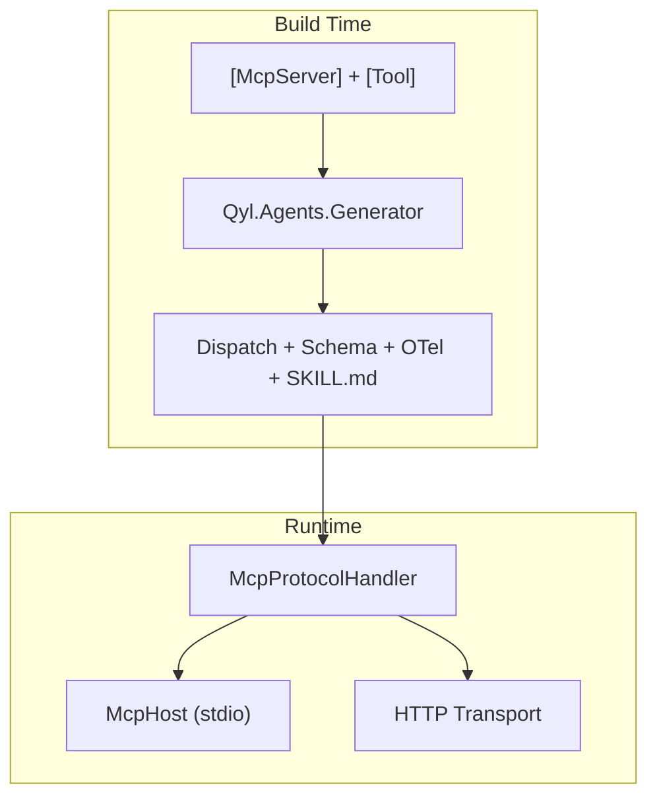

netagents publishes packages for managing `.agents` skill repositories and building compile-time MCP servers in .NET.

## Packages

| Package                   | Purpose                                                         |
| ------------------------- | --------------------------------------------------------------- |
| `NetAgents`               | CLI tool for `.agents` directories (init, install, sync, trust) |
| `Qyl.Agents.Abstractions` | `[McpServer]` and `[Tool]` marker attributes (netstandard2.0)   |
| `Qyl.Agents.Generator`    | Source generator emitting dispatch, schema, OTel, and SKILL.md  |
| `Qyl.Agents`              | Runtime protocol handler and stdio host                         |

## Quick Start

Define a server with attributes — the generator produces everything at build time:

```csharp
using Qyl.Agents;

[McpServer("calc-server")]
public partial class CalcServer
{
    /// <summary>Adds two numbers</summary>
    [Tool]
    public int Add(int a, int b) => a + b;
}
```

The generator emits:

- `DispatchToolCallAsync` — routes tool calls by name
- `GetServerInfo` / `GetToolInfos` — MCP metadata
- JSON Schema for each tool's input parameters
- OpenTelemetry spans and metrics
- SKILL.md content for dotagents distribution

## Install

```bash
dotnet add package Qyl.Agents.Abstractions
dotnet add package Qyl.Agents.Generator
dotnet add package Qyl.Agents
```

For the CLI:

```bash
dotnet tool install --global NetAgents
```

## Architecture



## Repository Management

The CLI manages `.agents` skill directories:

```bash
netagents init                    # Initialize project
netagents add getsentry/dotagents # Add a skill source
netagents install                 # Install all skills
netagents sync                    # Update to latest
netagents doctor                  # Verify installation
```
